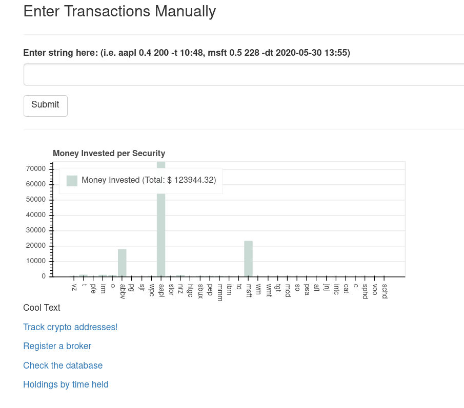
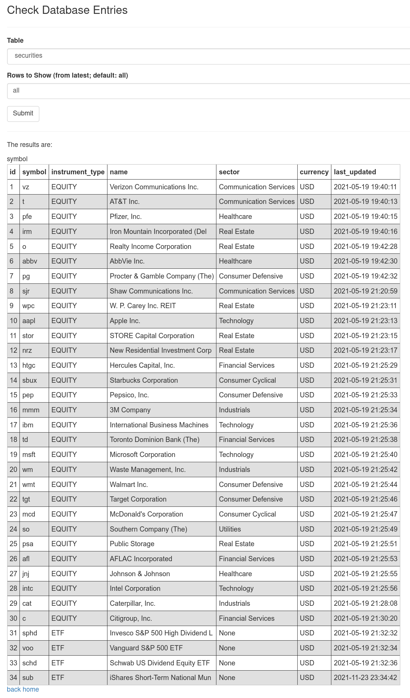
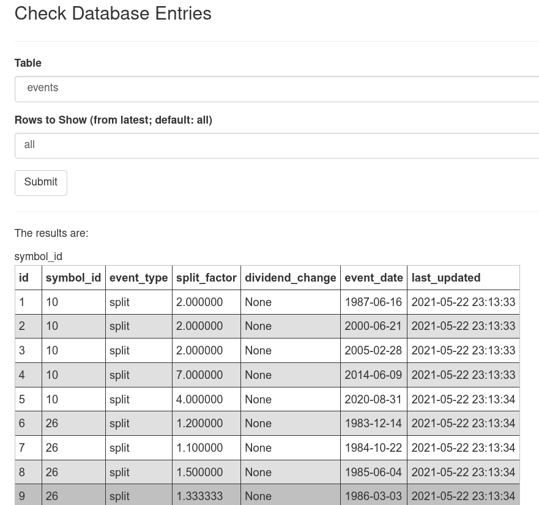
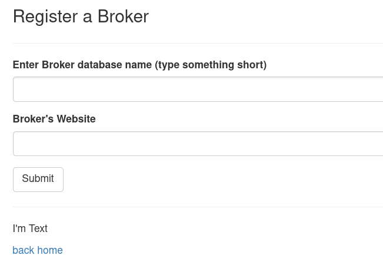
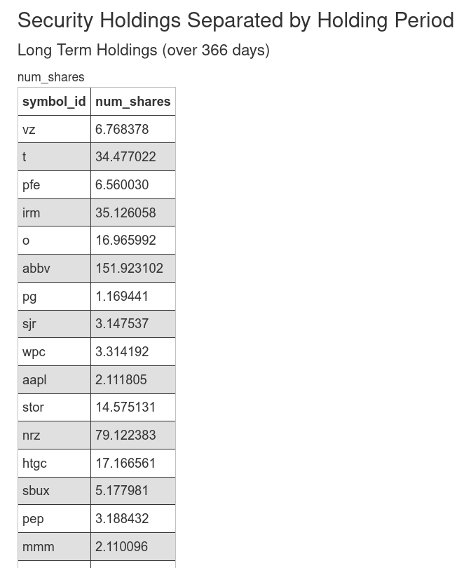

# Asset Portfolio

Track a portfolio of different assets and receive analytical information about them. This code has tools to automatically take into account stock splits and will even find dividend payments by doing some webscrapping (this feature is very prone to errors since there is no API). 

This project makes use of a MySQL database to store the data. However, thanks to using an ORM intermediary (Flask-SQLAlchemy), you can easily swap with other databases. The app will automatically look for a configuration file called `mysql_config.yml`. It is not included in the repository but it simply contains the necessary information to generate the URI for the database you want to use. 

### How to Run
To run, simply do:
```sh
python app.py 
```
inside the asset_portfolio subfolder. Make sure you setup your database and database configuration file before running the code. 

-----
## More Documentation
I wrote [this blog post](https://andresberejnoi.com/building-a-simple-flask-app-with-sqlalchemy/) about a toy project that is very similar in nature to this one. I would recommend you to check it out to make better sense of some of the code here.

----
## Externally Run Tools
The tool to compute total shares based on stock splits is in the file `database_operations.py`. The function is called `events_table_updater`. There is another function for dividends, aptly called: `dividends_table_updater`.

These functions should be run independently from the main script and on regular intervals. I was thinking of setting up a cron-job to run them but I have not done so yet. 

-----
## GUI and Pages
I'm no graphic or GUI designer, so cut me some slack if the appearance of the project looks like a poorly made website from the early 90's.

The html for the pages can be found under the subfolder `asset_portfolio/templates`. Here are some screenshots of what you will see once you run the code and enter some data. 

### Home Page
Here is where the user enters the transactional information. It is currently set up for manual entry, which is not ideal, but I built it with Robinhood in mind, and they still do not have an official API to work with.

The interface shows a basic graph powered by a Bookeh server running in the back. You can hover over each stock to get more information. 


### Database Page




### Broker Registration Page
Here is a place where you register brokers you later they are used. It's not incredibly useful, but it is there. 


### Holdings Page
In this page I show all asset holdings but separating the portions that would be considered long term holdings from short term holdings. 

For example, if I had 10 shares of Apple from 5 years ago, and 5 shares of Apple from 6 months ago, the program would show those two lots separately. 

